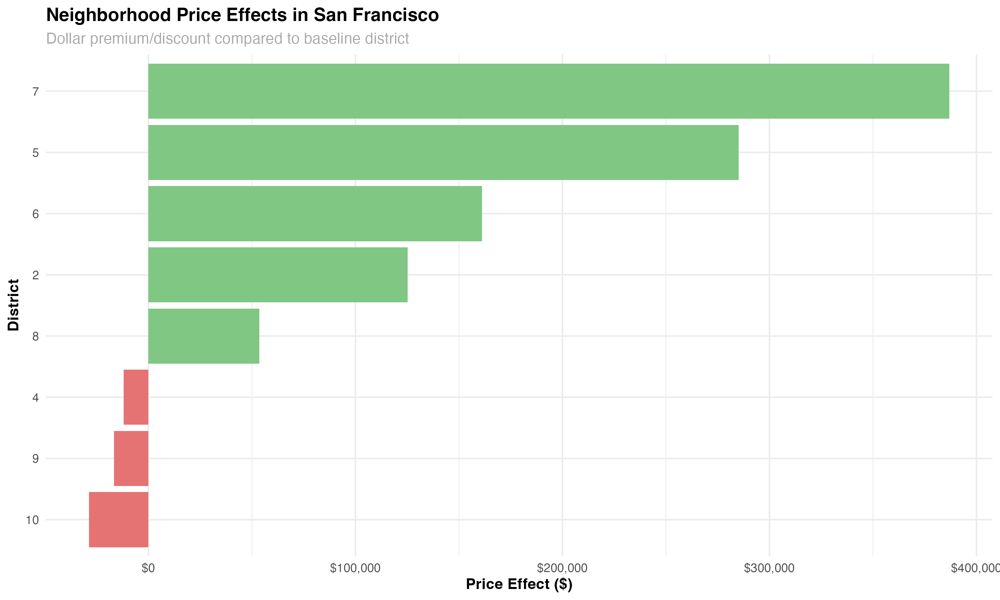
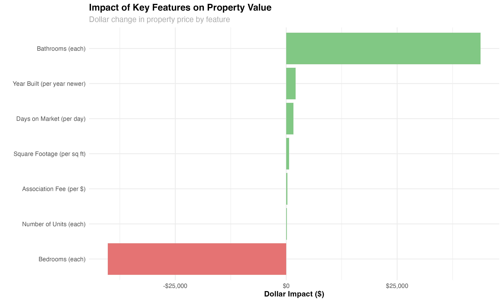
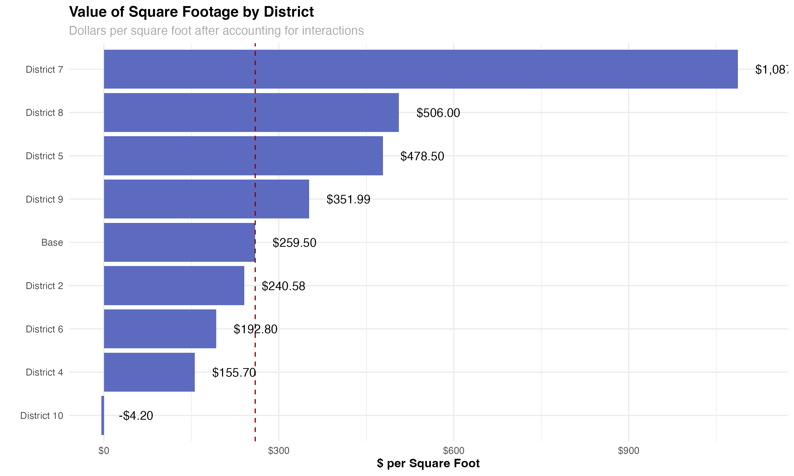
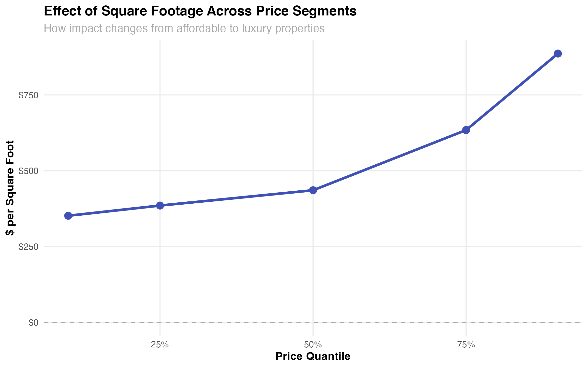
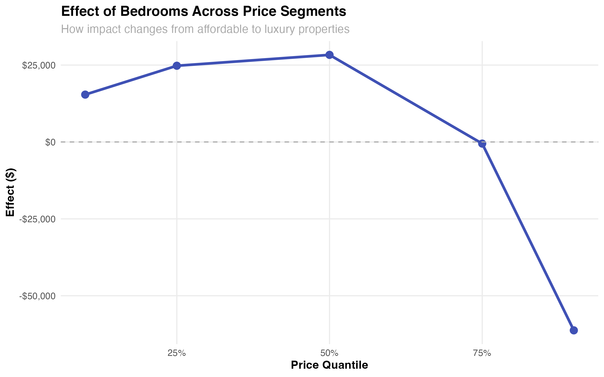
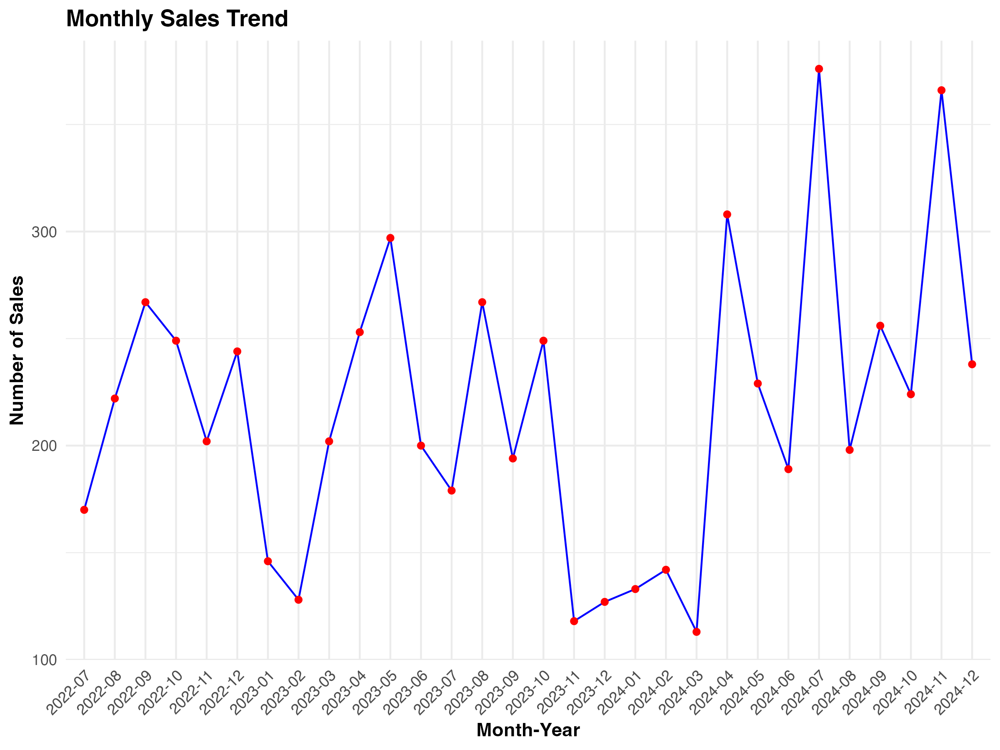
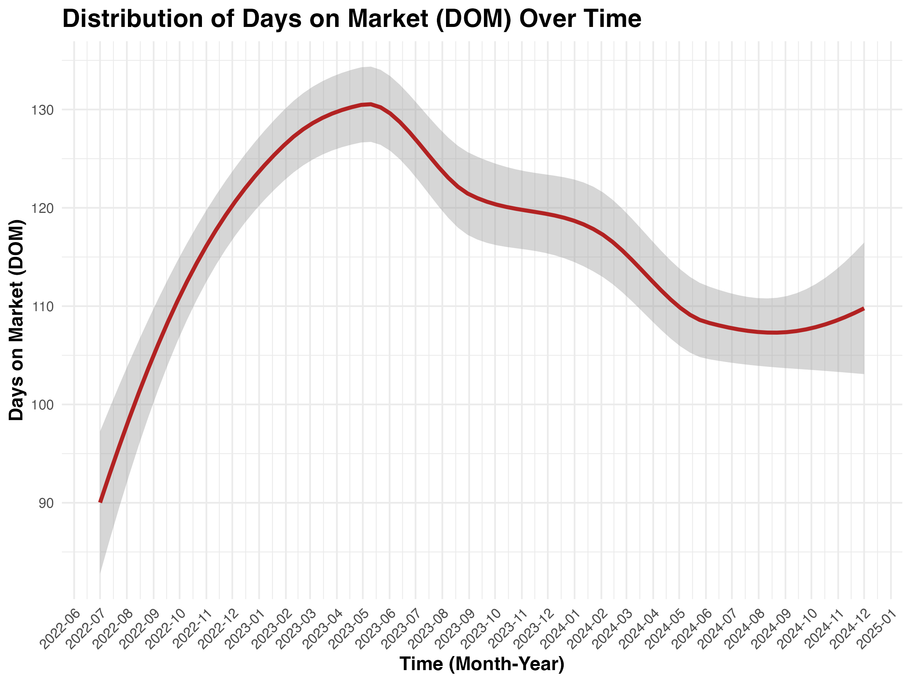
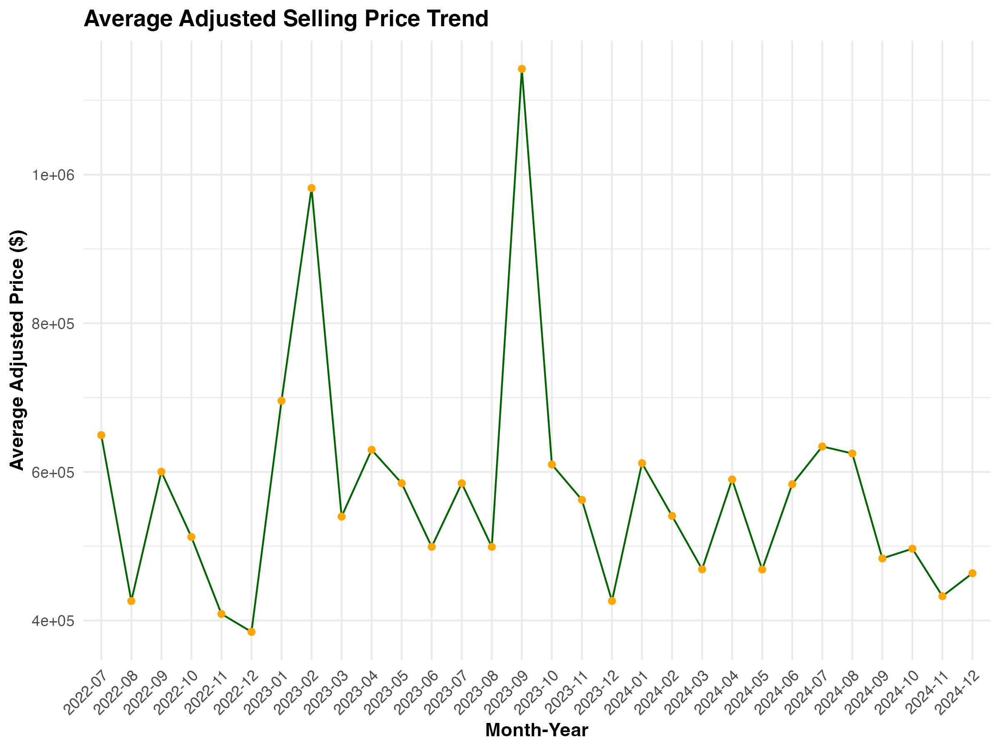
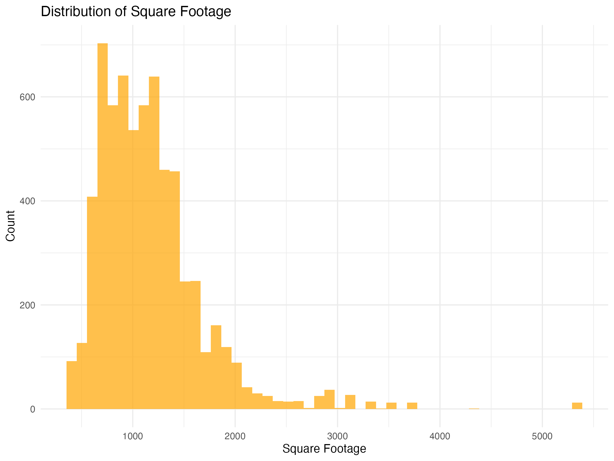
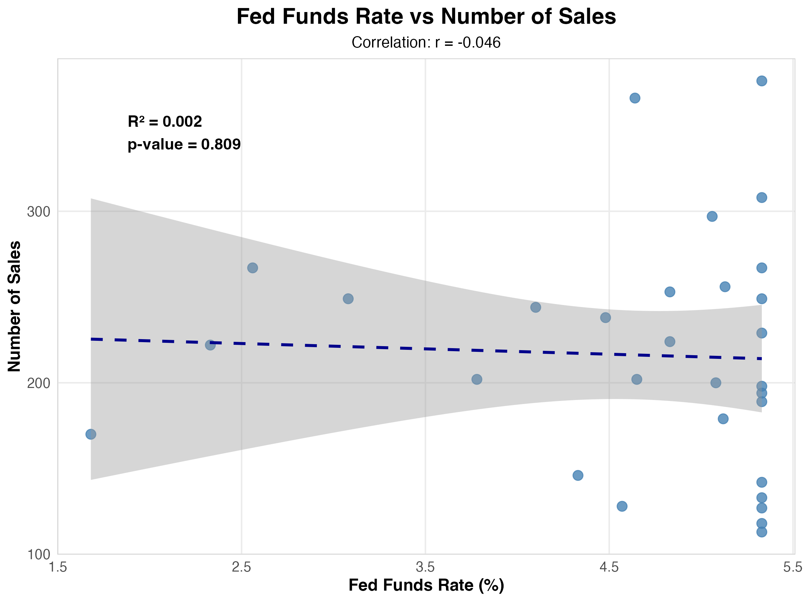

```{r setup, include=FALSE}
knitr::opts_chunk$set(echo = TRUE)
```

```{r}
# Load necessary libraries
library(ggplot2)
library(dplyr)
library(readr)
library(lubridate)
library(tidyr)
library(gridExtra)
library(quantmod)
library(sf)
library(ggspatial)
```


```{r}
# Load the dataset 
data <- read_csv("San Francisco Real Estate Data.csv")

# View basic structure of the dataset
str(data)
summary(data)

# Remove rows with missing values to prevent model errors
data <- na.omit(data)

# Standardize column names
data <- data %>% rename_all(make.names)
```

```{r}

```


```{r}
# Convert date columns to Date type
data$Listing_Date <- mdy(data$Listing.Date)
data$Selling_Date <- mdy(data$Selling.Date)

data$Selling_Date <- as.Date(data$Selling_Date)
data$Listing_Date <- as.Date(data$Listing_Date)

# Create a new column for Days on Market (DOM)
data$DOM <- as.numeric(difftime(data$Selling_Date, data$Listing_Date, units="days"))

# Get CPI data using quantmod
getSymbols("CPIAUCSL", src="FRED")
cpi_data <- data.frame(Date=index(CPIAUCSL), CPI=coredata(CPIAUCSL))
cpi_data$Date <- as.Date(cpi_data$Date)

data$Listing.Date <- format(ymd(data$Listing.Date), "%Y")
data$Selling.Date <- format(ymd(data$Selling.Date), "%Y")
cpi_data$Date <- format(ymd(cpi_data$Date), "%Y")

# Merge CPI data with property data
data <- left_join(data, cpi_data, by=c("Selling.Date" = "Date"))

# Adjust prices for inflation
data <- data %>% mutate(
  Adjusted_Selling_Price = Curr.Selling.Price / CPIAUCSL * 100,
  Adjusted_Listing_Price = Listing.Price / CPIAUCSL * 100,
  Adjusted_Price_per_SqFt = Adjusted_Selling_Price / Square.Footage
)

# Create Month_Year for later
data$Month_Year <- format(data$Selling_Date, "%Y-%m")
```

```{r}
# Market Segmentation Analysis
## Price Analysis by Number of Bedrooms
bedroom_price_plot <- ggplot(data, aes(x=factor(Bedrooms), y=Adjusted_Selling_Price)) +
  geom_boxplot(fill='cyan') +
  labs(title="Number of Bedrooms vs. Adjusted Selling Price", x="Number of Bedrooms", y="Adjusted Selling Price") +
  theme_minimal()

## Price Analysis by Number of Bathrooms
bathroom_price_plot <- ggplot(data, aes(x=factor(Total.Bathrooms), y=Adjusted_Selling_Price)) +
  geom_boxplot(fill='lightblue') +
  labs(title="Number of Bathrooms vs. Adjusted Selling Price", x="Number of Bathrooms", y="Adjusted Selling Price") +
  theme_minimal()

## Square Footage Distribution
sqft_distribution <- ggplot(data, aes(x=Square.Footage)) +
  geom_histogram(bins=50, fill='orange', alpha=0.7) +
  labs(title="Distribution of Square Footage", x="Square Footage", y="Count") +
  theme_minimal()

## Relationship Between Square Footage and Price
size_price_plot <- ggplot(data, aes(x=Square.Footage, y=Adjusted_Selling_Price)) +
  geom_point(alpha=0.5, color='blue') +
  geom_smooth(method='lm', color='red') +
  labs(title="Square Footage vs. Adjusted Selling Price", x="Square Footage", y="Adjusted Selling Price") +
  theme_minimal()

# Neighborhood-Level Sales Analysis
neighborhood <- data %>% summarize(Sales=n())
neighborhood_price_plot <- ggplot(data, aes(x=factor(Area.Desc), y=n(Sales))) +
  geom_boxplot(fill='purple') +
  labs(title="Neighborhood vs. Adjusted Selling Price", x="Neighborhood", y="Adjusted Selling Price") +
  theme(axis.text.x = element_text(angle = 45, hjust = 1))

# Time Series Analysis
sales_trend <- data %>% group_by(Month_Year=format(Selling_Date, "%Y-%m")) %>% summarise(Sales=n())
sales_trend_plot <- ggplot(sales_trend, aes(x=Month_Year, y=Sales)) +
  geom_line(group=1, color="blue") +
  geom_point(color="red") +
  labs(title="Monthly Sales Trend", x="Month-Year", y="Number of Sales") +
  theme(axis.text.x = element_text(angle = 45, hjust = 1))

price_trend <- data %>% group_by(Month_Year) %>% summarise(Avg_Adjusted_Price=mean(Adjusted_Selling_Price, na.rm=TRUE))
price_trend_plot <- ggplot(price_trend, aes(x=Month_Year, y=Avg_Adjusted_Price)) +
  geom_line(group=1, color="darkgreen") +
  geom_point(color="orange") +
  labs(title="Average Adjusted Selling Price Trend", x="Month-Year", y="Average Adjusted Price ($)") +
  theme(axis.text.x = element_text(angle = 45, hjust = 1))

# Days on Market (DOM) Analysis
# Convert Month_Year to proper Date format
data$Month_Year_Date <- as.Date(paste0(data$Month_Year, "-01"), format="%Y-%m-%d")

# Create the plot with the converted date column
DOM_plot <- ggplot(data, aes(x=Month_Year_Date, y=DOM)) +
  geom_smooth(method="loess", color="firebrick", size=1.2) +
  labs(
    title="Distribution of Days on Market (DOM) Over Time",
    x="Time (Month-Year)",
    y="Days on Market (DOM)"
  ) +
  theme_minimal() +
  theme(
    axis.text.x = element_text(angle=45, hjust=1),
    axis.title = element_text(size=12, face="bold"),
    plot.title = element_text(size=16, face="bold")
  ) +
  scale_x_date(date_labels = "%Y-%m", date_breaks = "1 month")  # Format date labels

# Display all plots together
bedroom_price_plot
bathroom_price_plot
sqft_distribution
size_price_plot
neighborhood_price_plot
sales_trend_plot
price_trend_plot
DOM_plot

```
```{r}
# Time Series Analysis
sales_trend <- data %>% group_by(Month_Year=format(Selling_Date, "%Y-%m")) %>% summarise(Sales=n())
sales_trend_plot <- ggplot(sales_trend, aes(x=Month_Year, y=Sales)) +
  geom_line(group=1, color="blue") +
  geom_point(color="red") +
  labs(title="Monthly Sales Trend", x="Month-Year", y="Number of Sales") +
  theme(axis.text.x = element_text(angle = 45, hjust = 1))

# Neighborhood-Level Sales Analysis
neighborhood <- data %>% group_by(Month_Year=format(Selling_Date, "%Y-%m")) %>% summarise(Sales=n())
neighborhood_sales_plot <- ggplot(data, aes(x=factor(Area.Desc), y=summarise(Sales=n()))) +
  geom_boxplot(fill='purple') +
  labs(title="Neighborhood vs. Volume of Sales", x="Neighborhood", y="Sales") +
  theme(axis.text.x = element_text(angle = 45, hjust = 1))
neighborhood_sales_plot

summary(data$Adjusted_Price_per_SqFt)
luxury <- filter(data,Adjusted_Price_per_SqFt>530.9)
normal <- filter(data,Adjusted_Price_per_SqFt<530.9)

mean(luxury$DOM)
mean(normal$DOM)
```


```{r}
# Load required libraries
library(quantmod)
library(ggplot2)
library(dplyr)
library(lubridate)
library(ggpubr)  # For adding correlation coefficient to plot

# Retrieve interest rate data
getSymbols("FEDFUNDS", src = "FRED")
interest_rates <- FEDFUNDS

# Convert interest rate data into a data frame for easier manipulation
interest_rate_df <- data.frame(Date = index(FEDFUNDS), FEDFUNDS = coredata(FEDFUNDS))

# Convert the Date column to Date format if not already
interest_rate_df$Date <- as.Date(interest_rate_df$Date)

# Extract year and month to create YYYY-MM format
interest_rate_df$Month_Year <- format(interest_rate_df$Date, "%Y-%m")

# If there are multiple entries per month, take the average
interest_rate_monthly <- interest_rate_df %>%
  group_by(Month_Year) %>%
  summarize(FEDFUNDS = mean(FEDFUNDS, na.rm = TRUE))

# Count sales by Month_Year (assuming each row in 'data' is a sale)
sales_by_month <- data %>%
  group_by(Month_Year) %>%
  summarize(Sales = n())  # Count number of rows (sales) per month

# Merge the datasets on Month_Year
merged_data <- merge(sales_by_month, interest_rate_monthly, by = "Month_Year", all.x = FALSE)

# Remove NA values to avoid plotting issues
merged_data <- merged_data %>% filter(!is.na(FEDFUNDS) & !is.na(Sales))

# Calculate correlation coefficient
correlation <- cor(merged_data$FEDFUNDS, merged_data$Sales, method = "pearson")
correlation_text <- paste("Correlation: r =", round(correlation, 3))

# Fit linear model to get more statistics
lm_fit <- lm(Sales ~ FEDFUNDS, data = merged_data)
lm_summary <- summary(lm_fit)
p_value <- format.pval(lm_summary$coefficients[2,4], digits = 3)
r_squared <- round(lm_summary$r.squared, 3)

# Create annotation text
stats_text <- paste0(
  "R² = ", r_squared, "\n",
  "p-value = ", p_value
)

# Create a scatterplot of Fed Funds Rate vs Number of Sales with correlation info
sales_trend_plot_interest <- ggplot(merged_data, aes(x = FEDFUNDS, y = Sales)) +
  geom_point(size = 3, alpha = 0.8, color = "steelblue") +
  geom_smooth(method = "lm", se = TRUE, color = "darkblue", linetype = "dashed") +
  labs(title = "Fed Funds Rate vs Number of Sales",
       x = "Fed Funds Rate (%)",
       y = "Number of Sales",
       subtitle = correlation_text) +
  theme_minimal() +
  theme(
    panel.grid.minor = element_blank(),
    panel.border = element_rect(color = "lightgray", fill = NA),
    plot.title = element_text(size = 16, face = "bold", hjust = 0.5),
    plot.subtitle = element_text(hjust = 0.5),
    axis.title = element_text(size = 12, face = "bold"),
    axis.text = element_text(size = 10)
  ) +
  # Add text annotation with detailed statistics
  annotate("text", x = min(merged_data$FEDFUNDS) + 0.2, 
           y = max(merged_data$Sales) - 20, 
           label = stats_text, 
           hjust = 0, vjust = 1, 
           size = 4, color = "black",
           fontface = "bold")

# Display the plot
print(sales_trend_plot_interest)
```

```{r}
# Load required libraries
library(lme4)       # For mixed effects models
library(mgcv)       # For generalized additive models
library(quantreg)   # For quantile regression
library(glmnet)     # For regularized regression
library(sjPlot)     # For model visualization
library(gratia)     # For GAM visualizations
library(vip)        # For variable importance plots
library(ggplot2)    # For general plotting
library(interactions) # For interaction effects
library(gridExtra)  # For arranging multiple plots
library(dplyr)      # For data manipulation

# Set seed for reproducibility
set.seed(123)

# Define main analysis function
analyze_real_estate <- function(data) {
  # Create results directory if it doesn't exist
  if(!dir.exists("results")) {
    dir.create("results")
  }
  
  # Data preparation
  # Ensure numeric variables are properly formatted
  numeric_vars <- c("Adjusted_Selling_Price", "Square.Footage", "DOM", 
                   "Association.Fee", "Year.Built", "X..of.Units", "Lot.Size")
  
  for(var in numeric_vars) {
    if(var %in% names(data)) {
      data[[var]] <- as.numeric(as.character(data[[var]]))
    }
  }
  
  # Convert categorical variables to factors
  factor_vars <- c("Area.Desc", "Parking.Access", "Parking.Features", 
                  "Parking.Type", "Subdivision.Display")
  
  for(var in factor_vars) {
    if(var %in% names(data)) {
      data[[var]] <- as.factor(data[[var]])
    }
  }
  
  # Remove rows with missing values in key variables
  data <- data %>%
    filter(!is.na(Adjusted_Selling_Price),
           !is.na(Square.Footage))
  
  # Basic descriptive statistics
  summary_stats <- summary(data[, c("Adjusted_Selling_Price", "Square.Footage", 
                                   "Bedrooms", "Total.Bathrooms", "DOM", 
                                   "Association.Fee", "Year.Built")])
  
  write.csv(as.data.frame(summary_stats), "results/summary_statistics.csv")
  
  # Basic correlation matrix
  numeric_data <- data %>%
    select_if(is.numeric)
  
  corr_matrix <- cor(numeric_data, use = "pairwise.complete.obs")
  
  # 1. STANDARD LINEAR MODEL
  # ------------------------
  cat("Running standard linear model...\n")
  
  lm_formula <- as.formula("Adjusted_Selling_Price ~ Square.Footage + Bedrooms + Total.Bathrooms + 
                          DOM + Area.Desc + Association.Fee + Year.Built + X..of.Units")
  
  standard_model <- lm(lm_formula, data = data)
  
  # Save model summary
  sink("results/standard_model_summary.txt")
  print(summary(standard_model))
  sink()
  
  # Create diagnostic plots
  pdf("results/standard_model_diagnostics.pdf")
  par(mfrow = c(2, 2))
  plot(standard_model)
  dev.off()
  
  
  # 2. MIXED EFFECTS MODEL
  # ----------------------
  cat("Running mixed effects model...\n")
  
  tryCatch({
    mixed_model <- lmer(Adjusted_Selling_Price ~ Square.Footage + Bedrooms + Total.Bathrooms + 
                        DOM + Association.Fee + Year.Built + X..of.Units + 
                        (1|Area.Desc), data = data)
    
    # Save model summary
    sink("results/mixed_model_summary.txt")
    print(summary(mixed_model))
    sink()
    
    # Plot random effects
    pdf("results/mixed_model_ranef.pdf", width = 10, height = 8)
    plot_model(mixed_model, type = "re", sort.est = TRUE)
    dev.off()
    
    # Plot predicted values by neighborhood
    pdf("results/mixed_model_predictions.pdf", width = 10, height = 8)
    plot_model(mixed_model, type = "pred", terms = c("Square.Footage", "Area.Desc [sample=5]"))
    dev.off()
  }, error = function(e) {
    cat("Error in mixed model:", e$message, "\n")
  })
  
  
  # 3. GENERALIZED ADDITIVE MODEL
  # -----------------------------
  cat("Running generalized additive model...\n")
  
  tryCatch({
    gam_model <- gam(Adjusted_Selling_Price ~ s(Square.Footage) + s(Year.Built) + 
                     s(DOM) + Bedrooms + Total.Bathrooms + Area.Desc,
                     data = data)
    
    # Save model summary
    sink("results/gam_model_summary.txt")
    print(summary(gam_model))
    sink()
    
    # Plot smooth terms
    pdf("results/gam_smooths.pdf", width = 10, height = 8)
    draw(gam_model)
    dev.off()
    
    # Create partial effect plots
    pdf("results/gam_partial_effects.pdf", width = 10, height = 8)
    plot(gam_model, pages = 1)
    dev.off()
  }, error = function(e) {
    cat("Error in GAM model:", e$message, "\n")
  })
  
  
  # 4. QUANTILE REGRESSION
  # ----------------------
  cat("Running quantile regression...\n")
  
  tryCatch({
    # Define quantiles to analyze
    taus <- c(0.1, 0.25, 0.5, 0.75, 0.9)
    
    # Run quantile regression
    quant_model <- rq(Adjusted_Selling_Price ~ Square.Footage + Bedrooms + Total.Bathrooms + 
                      DOM + Year.Built + X..of.Units, 
                      tau = taus, data = data)
    
    # Save model summary
    sink("results/quantile_model_summary.txt")
    print(summary(quant_model))
    sink()
    
    # Create coefficient plot
    pdf("results/quantile_coefficients.pdf", width = 10, height = 8)
    plot(summary(quant_model))
    dev.off()
  }, error = function(e) {
    cat("Error in quantile regression:", e$message, "\n")
  })
  
  
  # 5. REGULARIZED REGRESSION
  # -------------------------
  cat("Running regularized regression...\n")
  
  tryCatch({
    # Prepare matrix format for glmnet
    x_vars <- c("Square.Footage", "Bedrooms", "Total.Bathrooms", "DOM", 
                "Association.Fee", "Year.Built", "X..of.Units")
    
    # Add categorical variables if they exist
    cat_vars <- c("Area.Desc", "Parking.Access", "Parking.Features", "Parking.Type")
    x_vars <- c(x_vars, cat_vars[cat_vars %in% names(data)])
    
    # Create formula and model matrix
    x_formula <- as.formula(paste("~", paste(x_vars, collapse = " + "), "- 1"))
    x <- model.matrix(x_formula, data = data)
    y <- data$Adjusted_Selling_Price
    
    # Cross-validation to find optimal lambda
    cv_model <- cv.glmnet(x, y, alpha = 0.5)
    
    # Fit elastic net model
    elastic_model <- glmnet(x, y, alpha = 0.5, lambda = cv_model$lambda.1se)
    
    # Extract coefficients
    elastic_coefs <- coef(elastic_model)
    
    # Save coefficients
    sink("results/elastic_net_coefficients.txt")
    print(elastic_coefs)
    sink()
    
    # Plot variable importance
    pdf("results/elastic_net_importance.pdf", width = 10, height = 8)
    plot(vip(elastic_model))
    dev.off()
    
    # Plot lambda selection
    pdf("results/elastic_net_lambda.pdf", width = 10, height = 6)
    plot(cv_model)
    dev.off()
  }, error = function(e) {
    cat("Error in regularized regression:", e$message, "\n")
  })
  
  
  # 6. INTERACTION EFFECTS
  # ----------------------
  cat("Running interaction model...\n")
  
  tryCatch({
    # Model with key interactions
    interact_model <- lm(Adjusted_Selling_Price ~ Square.Footage * Area.Desc + 
                         Bedrooms + Total.Bathrooms + Year.Built * X..of.Units, 
                         data = data)
    
    # Save model summary
    sink("results/interaction_model_summary.txt")
    print(summary(interact_model))
    sink()
    
    # Generate interaction plots
    pdf("results/interaction_plots.pdf", width = 10, height = 8)
    
    # Square footage by area
    if("Area.Desc" %in% names(data)) {
      print(interact_plot(interact_model, pred = "Square.Footage", modx = "Area.Desc",
                        interval = TRUE, plot.points = TRUE,
                        main = "Price vs. Square Footage by Area"))
    }
    
    # Year built by number of units
    if("X..of.Units" %in% names(data) & "Year.Built" %in% names(data)) {
      print(interact_plot(interact_model, pred = "Year.Built", modx = "X..of.Units",
                        interval = TRUE, plot.points = TRUE,
                        main = "Price vs. Year Built by Number of Units"))
    }
    dev.off()
  }, error = function(e) {
    cat("Error in interaction model:", e$message, "\n")
  })
  
  
  # 7. COMPREHENSIVE MODEL COMPARISON
  # --------------------------------
  cat("Generating model comparison...\n")
  
  tryCatch({
    # Create a list of available models
    models_list <- list()
    model_names <- c()
    
    if(exists("standard_model")) {
      models_list <- c(models_list, list(standard_model))
      model_names <- c(model_names, "Standard Linear")
    }
    
    if(exists("mixed_model")) {
      models_list <- c(models_list, list(mixed_model))
      model_names <- c(model_names, "Mixed Effects")
    }
    
    if(exists("gam_model")) {
      models_list <- c(models_list, list(gam_model))
      model_names <- c(model_names, "GAM")
    }
    
    if(exists("interact_model")) {
      models_list <- c(models_list, list(interact_model))
      model_names <- c(model_names, "Interaction")
    }
    
    # Compare models if we have at least 2
    if(length(models_list) >= 2) {
      # Create comparison table with AIC, BIC
      comparison_df <- data.frame(
        Model = model_names,
        AIC = sapply(models_list, AIC),
        BIC = sapply(models_list, BIC)
      )
      
      # Add R-squared where available
      r_squared <- sapply(models_list, function(m) {
        if("r.squared" %in% names(summary(m))) {
          return(summary(m)$r.squared)
        } else {
          return(NA)
        }
      })
      
      comparison_df$R_squared <- r_squared
      
      # Save comparison
      write.csv(comparison_df, "results/model_comparison.csv", row.names = FALSE)
    }
  }, error = function(e) {
    cat("Error in model comparison:", e$message, "\n")
  })
  
  # Generate final report with key findings
  cat("Generating final report...\n")
  
  sink("results/analysis_summary.txt")
  cat("REAL ESTATE TRANSACTION ANALYSIS SUMMARY\n")
  cat("=======================================\n\n")
  
  cat("Data Summary:\n")
  cat("- Number of transactions:", nrow(data), "\n")
  cat("- Price range: $", min(data$Adjusted_Selling_Price, na.rm = TRUE), 
      " to $", max(data$Adjusted_Selling_Price, na.rm = TRUE), "\n")
  
  if(exists("standard_model")) {
    cat("\nStandard Linear Model:\n")
    cat("- R-squared:", round(summary(standard_model)$r.squared, 4), "\n")
    cat("- Key factors:\n")
    
    coefs <- summary(standard_model)$coefficients
    sig_vars <- rownames(coefs)[coefs[, 4] < 0.05]
    sig_vars <- sig_vars[sig_vars != "(Intercept)"]
    
    for(var in sig_vars[1:min(5, length(sig_vars))]) {
      cat("  * ", var, ": ", round(coefs[var, 1], 4), "\n", sep = "")
    }
  }
  
  if(exists("gam_model")) {
    cat("\nGeneralized Additive Model:\n")
    cat("- R-squared:", round(summary(gam_model)$r.sq, 4), "\n")
    cat("- Deviance explained:", round(summary(gam_model)$dev.expl * 100, 2), "%\n")
    cat("- Non-linear relationships found in:")
    
    smooth_terms <- summary(gam_model)$s.table
    sig_smooths <- rownames(smooth_terms)[smooth_terms[, 4] < 0.05]
    
    for(term in sig_smooths) {
      cat("\n  * ", term, sep = "")
    }
    cat("\n")
  }
  
  if(exists("elastic_model") && exists("cv_model")) {
    cat("\nRegularized Regression (Elastic Net):\n")
    
    # Get non-zero coefficients
    coef_matrix <- as.matrix(coef(elastic_model))
    non_zero <- coef_matrix[coef_matrix != 0, , drop = FALSE]
    
    cat("- Selected lambda:", round(cv_model$lambda.1se, 4), "\n")
    cat("- Number of features retained:", length(non_zero) - 1, "\n")
    cat("- Top 5 features by magnitude:\n")
    
    # Sort by absolute value and get top 5 (excluding intercept)
    non_zero_df <- data.frame(
      Variable = rownames(non_zero),
      Coefficient = non_zero[, 1]
    )
    non_zero_df <- non_zero_df[non_zero_df$Variable != "(Intercept)", ]
    non_zero_df <- non_zero_df[order(abs(non_zero_df$Coefficient), decreasing = TRUE), ]
    
    for(i in 1:min(5, nrow(non_zero_df))) {
      cat("  * ", non_zero_df$Variable[i], ": ", round(non_zero_df$Coefficient[i], 4), "\n", sep = "")
    }
  }
  
  cat("\nRecommendations for Further Analysis:\n")
  cat("1. Consider market segmentation analysis by price tiers\n")
  cat("2. Analyze seasonal trends if timestamp data is available\n")
  cat("3. Incorporate neighborhood amenities data if available\n")
  cat("4. Explore time-on-market prediction models\n")
  cat("5. Consider developing separate models for different property types\n")
  
  sink()
  
  cat("\nAnalysis complete! Results saved in the 'results' directory.\n")
  return(list(
    standard_model = if(exists("standard_model")) standard_model else NULL,
    mixed_model = if(exists("mixed_model")) mixed_model else NULL,
    gam_model = if(exists("gam_model")) gam_model else NULL,
    quant_model = if(exists("quant_model")) quant_model else NULL,
    elastic_model = if(exists("elastic_model")) elastic_model else NULL,
    interact_model = if(exists("interact_model")) interact_model else NULL
  ))
}

results <- analyze_real_estate(data)
print(results)
```

```{r}
# Real Estate Model Visualization Script
# This script creates visualizations of key findings from real estate model outputs

# Load required libraries
library(ggplot2)
library(dplyr)
library(tidyr)
library(gridExtra)
library(scales)

# Set a consistent theme for all plots
theme_set(theme_minimal() + 
          theme(plot.title = element_text(face = "bold"),
                plot.subtitle = element_text(color = "darkgray"),
                axis.title = element_text(face = "bold")))

# Create directory for saving plots
if(!dir.exists("visualization_results")) {
  dir.create("visualization_results")
}

# -------------------------------------------------------
# 1. Import model coefficients from standard linear model
# -------------------------------------------------------

# Standard model coefficients from output
standard_coefs <- data.frame(
  Variable = c("Square.Footage", "Bedrooms", "Total.Bathrooms", "DOM", 
               "Area.DescSF District 10", "Area.DescSF District 2", 
               "Area.DescSF District 4", "Area.DescSF District 5", 
               "Area.DescSF District 6", "Area.DescSF District 7", 
               "Area.DescSF District 8", "Area.DescSF District 9", 
               "Association.Fee", "Year.Built", "X..of.Units"),
  Coefficient = c(635.7, -40219.7, 43793.2, 1608.9, 
                  -28752.4, 125220.8, -11940.2, 285121.4, 
                  161141.6, 386918.5, 53512.1, -16673.1, 
                  258.8, 2120.5, 147.4)
)

# -------------------------------------------------------
# 2. Visualize key feature importance
# -------------------------------------------------------

# Prepare data for visualization - filter out area effects for separate plot
feature_coefs <- standard_coefs %>%
  filter(!grepl("Area.Desc", Variable)) %>%
  mutate(Variable = case_when(
    Variable == "Square.Footage" ~ "Square Footage (per sq ft)",
    Variable == "Total.Bathrooms" ~ "Bathrooms (each)",
    Variable == "Bedrooms" ~ "Bedrooms (each)",
    Variable == "DOM" ~ "Days on Market (per day)",
    Variable == "Association.Fee" ~ "Association Fee (per $)",
    Variable == "Year.Built" ~ "Year Built (per year newer)",
    Variable == "X..of.Units" ~ "Number of Units (each)",
    TRUE ~ Variable
  )) %>%
  mutate(Impact = case_when(
    Coefficient > 0 ~ "Positive",
    TRUE ~ "Negative"
  ))

# Create feature impact plot
feature_plot <- ggplot(feature_coefs, aes(x = reorder(Variable, Coefficient), y = Coefficient, fill = Impact)) +
  geom_col() +
  scale_fill_manual(values = c("Negative" = "#E57373", "Positive" = "#81C784")) +
  coord_flip() +
  labs(
    title = "Impact of Key Features on Property Value",
    subtitle = "Dollar change in property price by feature",
    x = "",
    y = "Dollar Impact ($)"
  ) +
  scale_y_continuous(labels = scales::dollar_format()) +
  theme(legend.position = "none")

# Save the plot
ggsave("visualization_results/feature_impact.png", feature_plot, width = 10, height = 6)

# -------------------------------------------------------
# 3. Visualize neighborhood effects
# -------------------------------------------------------

# Prepare data for neighborhood visualization
neighborhood_coefs <- standard_coefs %>%
  filter(grepl("Area.Desc", Variable)) %>%
  mutate(
    District = gsub("Area.DescSF District ", "", Variable),
    Impact = case_when(
      Coefficient > 0 ~ "Premium",
      TRUE ~ "Discount"
    )
  ) %>%
  arrange(desc(Coefficient))

# Create neighborhood impact plot
neighborhood_plot <- ggplot(neighborhood_coefs, aes(x = reorder(District, Coefficient), y = Coefficient, fill = Impact)) +
  geom_col() +
  scale_fill_manual(values = c("Discount" = "#E57373", "Premium" = "#81C784")) +
  coord_flip() +
  labs(
    title = "Neighborhood Price Effects in San Francisco",
    subtitle = "Dollar premium/discount compared to baseline district",
    x = "District",
    y = "Price Effect ($)"
  ) +
  scale_y_continuous(labels = scales::dollar_format()) +
  theme(legend.position = "none")

# Save the plot
ggsave("visualization_results/neighborhood_impact.png", neighborhood_plot, width = 10, height = 6)

# -------------------------------------------------------
# 4. Visualize quantile regression results
# -------------------------------------------------------

# Quantile regression coefficients from output
quant_data <- data.frame(
  Variable = rep(c("Square.Footage", "Bedrooms", "Total.Bathrooms", "DOM", "Year.Built", "X..of.Units"), each = 5),
  Quantile = rep(c(0.10, 0.25, 0.50, 0.75, 0.90), times = 6),
  Coefficient = c(
    # Square.Footage
    351.751862, 385.34754, 435.75588, 634.15394, 886.3800,
    # Bedrooms
    15399.834466, 24781.88583, 28320.26999, -528.51282, -61247.6854,
    # Total.Bathrooms
    -28068.433207, -7791.25126, 32803.79633, -7289.97073, 13615.9521,
    # DOM
    -3.150439, -73.62281, -150.88153, -103.62408, 326.6006,
    # Year.Built
    -191.527762, -298.92840, -250.55046, -188.86601, -449.4951,
    # X..of.Units
    42.885537, 50.25920, 63.20562, 55.81842, 157.0326
  )
)

# Function to create quantile plots for each variable
create_quantile_plot <- function(var_name, nice_name, y_label = "Effect ($)") {
  plot_data <- quant_data %>% filter(Variable == var_name)
  
  ggplot(plot_data, aes(x = Quantile, y = Coefficient)) +
    geom_line(size = 1.2, color = "#3F51B5") +
    geom_point(size = 3, color = "#3F51B5") +
    geom_hline(yintercept = 0, linetype = "dashed", color = "darkgray") +
    labs(
      title = paste("Effect of", nice_name, "Across Price Segments"),
      subtitle = "How impact changes from affordable to luxury properties",
      x = "Price Quantile",
      y = y_label
    ) +
    scale_x_continuous(labels = scales::percent) +
    scale_y_continuous(labels = scales::dollar_format()) +
    theme(panel.grid.minor = element_blank())
}

# Create and save individual quantile plots
sq_ft_plot <- create_quantile_plot("Square.Footage", "Square Footage", "$ per Square Foot")
ggsave("visualization_results/quantile_sq_footage.png", sq_ft_plot, width = 8, height = 5)

bedroom_plot <- create_quantile_plot("Bedrooms", "Bedrooms")
ggsave("visualization_results/quantile_bedrooms.png", bedroom_plot, width = 8, height = 5)

bathroom_plot <- create_quantile_plot("Total.Bathrooms", "Bathrooms")
ggsave("visualization_results/quantile_bathrooms.png", bathroom_plot, width = 8, height = 5)

year_plot <- create_quantile_plot("Year.Built", "Year Built", "$ per Year")
ggsave("visualization_results/quantile_year_built.png", year_plot, width = 8, height = 5)

# -------------------------------------------------------
# 5. Visualize Square Footage × District interactions
# -------------------------------------------------------

# Interaction coefficients from the output
interaction_data <- data.frame(
  District = c("Base", "District 10", "District 2", "District 4", "District 5", 
               "District 6", "District 7", "District 8", "District 9"),
  Base_Effect = c(259.5, 259.5, 259.5, 259.5, 259.5, 259.5, 259.5, 259.5, 259.5),
  Additional_Effect = c(0, -263.7, -18.92, -103.8, 219.0, -66.7, 827.5, 246.5, 92.49)
)

# Calculate total effect
interaction_data$Total_Effect <- interaction_data$Base_Effect + interaction_data$Additional_Effect

# Sort by total effect
interaction_data <- interaction_data %>% arrange(desc(Total_Effect))

# Create interaction plot
interaction_plot <- ggplot(interaction_data, aes(x = reorder(District, Total_Effect))) +
  geom_col(aes(y = Total_Effect), fill = "#5C6BC0") +
  geom_hline(yintercept = interaction_data$Base_Effect[1], linetype = "dashed", color = "darkred") +
  coord_flip() +
  labs(
    title = "Value of Square Footage by District",
    subtitle = "Dollars per square foot after accounting for interactions",
    x = "",
    y = "$ per Square Foot"
  ) +
  scale_y_continuous(labels = scales::dollar_format()) +
  geom_text(aes(y = Total_Effect + 30, label = scales::dollar(Total_Effect)), hjust = 0)

# Save the plot
ggsave("visualization_results/sqft_by_district.png", interaction_plot, width = 10, height = 6)

# -------------------------------------------------------
# 7. Create feature importance summary
# -------------------------------------------------------

# Prepare feature importance summary
feature_ranking <- feature_coefs %>%
  select(Variable, Coefficient) %>%
  rename(Dollar_Impact = Coefficient) %>%
  mutate(
    Relative_Importance = abs(Dollar_Impact) / sum(abs(Dollar_Impact)) * 100,
    Direction = ifelse(Dollar_Impact > 0, "Positive", "Negative")
  ) %>%
  arrange(desc(abs(Dollar_Impact)))

# Save feature ranking to CSV
write.csv(feature_ranking, "visualization_results/feature_ranking.csv", row.names = FALSE)

# -------------------------------------------------------
# 8. Visualize Mixed Effects Model Random Effects
# -------------------------------------------------------

# From the output, random effects standard deviation was 146367
random_effects_data <- data.frame(
  Component = c("Neighborhood (Random Effect)", "Unexplained Variation (Residual)"),
  Standard_Deviation = c(146367, 330070)
)

# Create random effects plot
random_effects_plot <- ggplot(random_effects_data, aes(x = Component, y = Standard_Deviation, fill = Component)) +
  geom_col() +
  scale_fill_manual(values = c("Neighborhood (Random Effect)" = "#7986CB", 
                               "Unexplained Variation (Residual)" = "#E0E0E0")) +
  labs(
    title = "Sources of Price Variation",
    subtitle = "Standard deviation in dollars",
    x = "",
    y = "Standard Deviation ($)"
  ) +
  scale_y_continuous(labels = scales::dollar_format()) +
  theme(legend.position = "none")

# Save the plot
ggsave("visualization_results/sales_trend_plot.png", sales_trend_plot, width = 8, height = 6)
ggsave("visualization_results/price_trend_plot.png", price_trend_plot, width = 8, height = 6)
ggsave("visualization_results/sqft_distribution.png", sqft_distribution, width = 8, height = 6)
ggsave("visualization_results/DOM_plot.png", DOM_plot, width = 8, height = 6)
ggsave("visualization_results/sales_trend_plot_interest.png", sales_trend_plot_interest, width = 8, height = 6)
```

```{r}
# -------------------------------------------------------
# 9. Create combined dashboard summary
# -------------------------------------------------------

# Create a function to generate a summary dashboard HTML
create_dashboard <- function() {
  html_content <- '
  <!DOCTYPE html>
  <html>
  <head>
    <title>San Francisco Real Estate Analysis Dashboard</title>
    <style>
      body { font-family: Arial, sans-serif; margin: 20px; line-height: 1.6; }
      h1 { color: #3F51B5; }
      h2 { color: #5C6BC0; margin-top: 30px; }
      .dashboard { display: flex; flex-wrap: wrap; }
      .card { background: #f9f9f9; border-radius: 8px; margin: 10px; padding: 15px; box-shadow: 0 2px 5px rgba(0,0,0,0.1); }
      .full-width { width: calc(100% - 50px); }
      .half-width { width: calc(50% - 50px); }
      img { max-width: 100%; border-radius: 5px; }
      table { border-collapse: collapse; width: 100%; }
      th, td { text-align: left; padding: 12px; }
      th { background-color: #5C6BC0; color: white; }
      tr:nth-child(even) { background-color: #f2f2f2; }
    </style>
  </head>
  <body>
    <h1>San Francisco Condo Market Analysis</h1>
    <h2>Patrick Swain</h2> 
    
    <div class="dashboard">
      <div class="card full-width">
        <h2>Summary</h2>
<p>
This analysis illustrates key factors influencing property prices across different districts. One prominent insight is the significant price premium associated with District 7, where homes command nearly $387,000 more than average, driven by location-based desirability. This effect is mirrored in the <strong>Square Footage Value by District</strong> plot, which highlights the dramatic disparity in price per square foot—exceeding $1,000/sqft in District 7 but falling below $200/sqft in District 10, reflecting socioeconomic and infrastructural variations.
</p>
<p>
Additionally, the <strong>Square Footage Effect Across Price Tiers</strong> visualization emphasizes how the impact of square footage intensifies in luxury markets, where homes in the top 90th percentile show a 2.5× greater return on added square footage than mid-tier properties, indicating that size matters more at higher price points. Interestingly, the <strong>Bedroom Effect Across Price Tiers</strong> chart reveals a counterintuitive trend: increasing the number of bedrooms may actually reduce property value when controlling for square footage, suggesting that buyers prioritize fewer, more spacious rooms.
</p>
<p>
Furthermore, the <strong>Days on Market (DOM)</strong> and <strong>Condo Sales by Month</strong> plots offer insights into market dynamics and liquidity, illustrating seasonal variations and temporal trends. Despite these fluctuations, the analysis finds no consistent relationship between condo sales volume and changes in the Federal Reserve interest rates, reflecting the complex interplay of local housing demand and broader macroeconomic forces.
</p>
<p>
Collectively, these visualizations provide a nuanced, data-driven understanding of San Francisco’s real estate market, underscoring the multidimensional factors that shape property valuation and buyer behavior.
</p>

        <h2>Key Insights</h2>
        <ul>
          <li>Location is the dominant factor in property pricing, with District 7 commanding a premium of nearly $387,000</li>
          <li>Square footage value varies dramatically by location - worth over $1,000/sqft in District 7 vs. under $200/sqft in District 10</li>
          <li>Impact of square footage increases with property price tier - 2.5× greater in luxury properties (90th percentile)</li>
          <li>Additional bedrooms decrease property value when controlling for square footage, suggesting buyers prefer fewer, larger rooms</li>
          <li>Property age effects vary by price segment, with mixed evidence about whether newer properties command higher prices</li>
          <li>There is no significant relationship between the number of condo sales per month and fluctuations in the Federal Reserve\'s interest rates</li>
        </ul>
        <h2>Tools</h2>
        <ul>
          <li>R libraries dplyr, ggplot2, tidyr, scales, lubridate, quantmod, randomForest, ggpubr, lme4, mgcv, quantreg, glmnet, sjPlot, gratia, and vip </li>
      </div>
      
      <div class="card half-width">
        <h2>Neighborhood Price Effects</h2>
        
      </div>
      
      <div class="card half-width">
        <h2>Feature Importance</h2>
        
      </div>
      
      <div class="card half-width">
        <h2>Square Footage Value by District</h2>
        
      </div>
      
      <div class="card half-width">
        <h2>Square Footage Effect Across Price Tiers</h2>
        
      </div>
      
      <div class="card half-width">
        <h2>Bedroom Effect Across Price Tiers</h2>
        
      </div>
      
      <div class="card half-width">
        <h2>Condo Sales by Month</h2>
        
      </div>
      
      <div class="card half-width">
        <h2>Days on Market (DOM)</h2>
        
      </div>
      
      <div class="card half-width">
        <h2>Condo Prices by Month</h2>
        
      </div>
      
      <div class="card half-width">
        <h2>Condo Square Footage</h2>
        
      </div>
      
      <div class="card half-width">
        <h2>Sales vs. Fed Interest Rates</h2>
        
      </div>
      
  </body>
  </html>
  '
  
  # Write the HTML to a file
  writeLines(html_content, "visualization_results/dashboard.html")
  
  cat("Dashboard HTML created at visualization_results/dashboard.html\n")
  cat("Note: Open this file in a web browser to view the complete dashboard\n")
}

# Generate the dashboard
create_dashboard()

# Print completion message
cat("\n=================================================================\n")
cat("Visualizations complete! Results saved in 'visualization_results' directory.\n")
cat("Key findings have been ranked and visualized based on model outputs.\n")
cat("=================================================================\n")
```